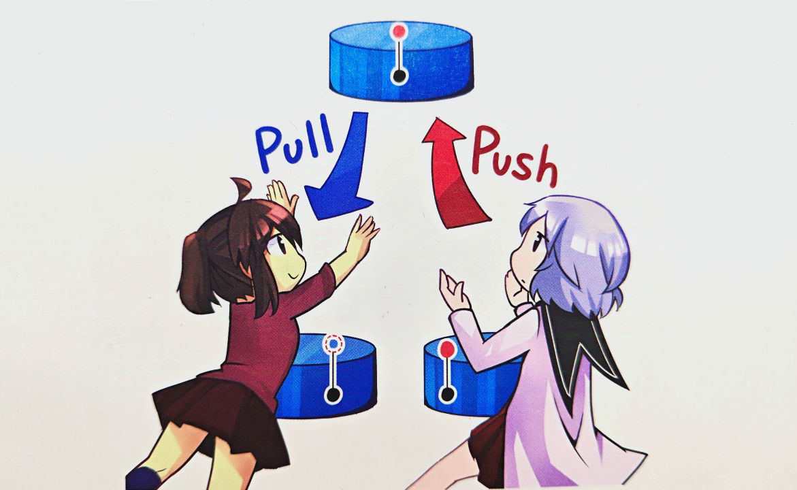

# 进阶 JavaScript 与 Git 入门

## 前言

欢迎来到 Week 2！本周我们将深入探讨如何通过 JavaScript 获取用户在页面上填写的内容，并进行一定的逻辑处理，随后改变页面元素的状态。此外，我们还会学习 Git 的基础操作，让你能够轻松管理代码版本，并与他人协作。让我们从 JavaScript 开始！

---

## JavaScript进阶知识

### DOM：获取用户输入并进行交互

JavaScript 作为前端开发中的核心语言，允许我们在网页中实现动态效果。本周，我们将学习如何使用 JavaScript 获取表单中的用户输入，并通过条件判断控制页面元素的行为。接下来我们通过一个实际例子逐步学习。

#### 1. 制作表单

要获取表单中用户输入的内容，我们可以使用 `document.getElementById()` 或 `document.querySelector()` 来访问特定的 HTML 元素，然后获取其值。

**例子**：假设我们有一个简单的文本输入框和一个复选框：

```html
<form>
  <label for="age">请输入你的年龄:</label>
  <input type="number" id="age" name="age">
  <br>
  <label for="maritalStatus">婚姻状况:</label>
  <input type="checkbox" id="maritalStatus" name="maritalStatus">
  <br>
  <button type="button" onclick="processForm()">提交</button>
</form>
<p id="message"></p>
```

在这个例子中，我们让用户输入他们的年龄，并提供一个婚姻状况复选框。

#### 2. 获取用户输入并进行逻辑判断

```javascript
function processForm() {
  // 获取用户输入的年龄
  let age = document.getElementById('age').value;

  // 将年龄转换为数字以便进行判断
  age = parseInt(age);

  // 根据年龄禁用或启用婚姻状况复选框
  if (age < 18) {
    document.getElementById('maritalStatus').disabled = true;
    document.getElementById('message').innerText = '你未成年，婚姻状况选项已禁用。';
  } else {
    document.getElementById('maritalStatus').disabled = false;
    document.getElementById('message').innerText = '你已成年，可以选择婚姻状况。';
  }
}
```

#### 3. 代码解读

* `document.getElementById('age').value`: 这段代码从页面上的输入框中获取用户输入的年龄。
* `parseInt()`: 将获取到的字符串形式的年龄转换为整数，以便我们可以进行数值比较。
* `document.getElementById('maritalStatus').disabled = true;`: 如果年龄小于 18 岁，我们禁用婚姻状况的复选框，表示未成年人不需要填写该项。
* `document.getElementById('message').innerText`: 根据条件设置不同的提示信息来通知用户。

这个里主要是为了展示如何根据用户的输入来改变网页中的其他元素的状态。你可以使用类似的方法处理更多的交互场景。

### 函数：提高代码的复用性

在前面的例子中，我们通过 JavaScript 实现了简单的用户输入交互，获取性别和年龄，显示对应的问候信息。但是这远远不够，要进行前后端的开发，我们还需要一些更加深入的知识和实践经验。

函数是 JavaScript 的核心概念，我们已经在上周文档中简单提到它，它允许我们将代码逻辑打包为一个独立的块，方便多次调用，减少重复代码。在上面的例子中，我们可以看到我们定义了一个名为 `processForm()` 的函数，每次用户点击提交按钮时，都会调用该函数进行处理。

例子：

```javascript
function greetUser(gender, age) {
  let greeting = '';
  if (gender === 'male') {
    greeting = (age >= 20) ? '小伙子，谢谢你的提交！' : '小兄弟，谢谢你的提交！';
  } else if (gender === 'female') {
    greeting = (age >= 20) ? '女士，谢谢你的提交！' : '小姑娘，谢谢你的提交！';
  } else {
    greeting = '谢谢你的提交！';
  }
  return greeting;
}

// 调用函数
let message = greetUser('male', 25);
console.log(message); // 输出：小伙子，谢谢你的提交！
```

在这个例子中，我们将问候逻辑独立为一个 `greetUser()` 函数，并通过传递参数来实现不同用户的问候。函数使代码更加清晰，也更容易复用。

### 数组：存储多个数据项

**数组**是用于存储多个值的结构。例如，我们可以将每次用户提交的信息存储在一个数组中，记录所有的提交历史。

例子：

```javascript
let submissions = []; // 初始化一个空数组

// 每次用户提交信息时，将其存入数组
submissions.push({ gender: 'female', age: 22 });
submissions.push({ gender: 'male', age: 19 });

console.log(submissions); // 输出提交记录数组
```

数组让我们能够轻松地管理和操作大量数据，尤其在需要存储多个对象时非常有用。我们可以通过下标来访问数组中的特定元素，例如 `submissions[0]` 可以访问第一个提交记录。

### 对象：将数据和行为封装在一起

对象 是 JavaScript 中用来封装数据和相关行为的一种结构。在我们调查问卷的例子中，可以将用户的性别、年龄等信息封装到一个对象中，并且还可以为对象添加功能，比如一个 `greet` 函数，让每个对象都能够根据自己的数据生成对应的问候信息。

例子：

```javascript
let person = {
  gender: 'female',
  age: 22,
  greet: function() {
    let greeting = '';
    if (this.gender === 'male') {
      greeting = (this.age >= 20) ? '小伙子，谢谢你的提交！' : '小兄弟，谢谢你的提交！';
    } else if (this.gender === 'female') {
      greeting = (this.age >= 20) ? '女士，谢谢你的提交！' : '小姑娘，谢谢你的提交！';
    } else {
      greeting = '谢谢你的提交！';
    }
    return greeting;
  }
};

console.log(person.greet()); // 输出：女士，谢谢你的提交！
```

在这个例子中，我们创建了一个 `person` 对象，存储了用户的性别和年龄，并且为对象定义了一个 `greet` 函数，能够根据对象的属性生成个性化的问候。

### 综合案例：将调查问卷与对象和数组结合

接下来，我们结合对象、函数和数组的知识，设计一个更复杂的系统。每次用户提交问卷时，我们都会创建一个新的 “人类” 对象，并将其存储在数组中。这个对象包含用户的性别、年龄信息，还可以生成个性化的问候语。

#### 新版的年龄与婚姻状况问卷：

:::details 这里理解即可
我们在开发的时候通常不会这样实现。在实际开发中，我们不会为每个对象单独创建方法，因为这样会浪费内存。每个对象的 `greet` 方法都是相同的，所以更好的做法是通过类或原型链，将 `greet` 方法定义一次，然后共享给所有对象。这样可以减少重复代码和内存消耗，同时提高代码的可维护性。
:::

```javascript
let people = []; // 初始化一个存储人类对象的数组

function processForm() {
  let gender = document.getElementById('gender').value;
  let age = parseInt(document.getElementById('age').value);

  // 创建一个人类对象
  let person = {
    gender: gender,
    age: age,
    greet: function() {
      let greeting = '';
      if (this.gender === 'male') {
        greeting = (this.age >= 20) ? '小伙子，谢谢你的提交！' : '小兄弟，谢谢你的提交！';
      } else if (this.gender === 'female') {
        greeting = (this.age >= 20) ? '女士，谢谢你的提交！' : '小姑娘，谢谢你的提交！';
      } else {
        greeting = '谢谢你的提交！';
      }
      return greeting;
    }
  };

  // 将人类对象存入数组
  people.push(person);

  // 显示当前人类的问候信息
  document.getElementById('greetingMessage').innerText = person.greet();

  // 输出当前提交的人类信息
  console.log(people);
}
```

#### 代码解释：

* 每次用户提交表单时，都会创建一个 `person` 对象，存储用户的性别和年龄。
* 对象内定义了 `greet` 函数，用于生成个性化的问候语。
* `people` 数组用于存储每次提交的所有人类对象。
* 最后将生成的问候信息显示在页面上，并将所有提交记录输出到控制台。

## 版本管理与团队协作

在开始学习 Git 之前，首先我们要理解它背后的基本概念。Git 是一个**分布式版本控制系统**，帮助我们追踪项目的变更历史，方便开发者在不同版本之间自由切换，同时允许团队成员在同一项目中进行协作。让我们从核心概念入手，逐步深入了解。随后我们会设置一个真实的工作场景，深入理解这些概念在实际操作中的体现，切身体会git带来的便利。

### 基本概念

#### 1. 仓库（Repository）

Git 中最基本的概念是**仓库**（Repository），它类似于一个项目的“历史档案馆”，记录了项目的所有文件和每次文件的修改。仓库可以分为：

* 本地仓库（Local Repository）：存储在你电脑上的代码版本控制历史，只有你自己可以看到和操作。
* 远程仓库（Remote Repository）：存储在服务器（如 GitHub）上的仓库，用来与其他开发者共享代码、协作开发。

这两个仓库之间存在联系：你可以将本地仓库中的更改推送到远程仓库，或者从远程仓库拉取更新到本地仓库。

#### 2. 工作区（Working Directory）

**工作区**是你实际工作的文件夹，你可以在里面进行文件修改、新增文件、删除文件等操作。工作区就是你打开项目文件夹时看到的内容。在工作区中进行的更改，Git 并不会立刻追踪，它只是反映了文件在电脑上的状态。

#### 3. 暂存区（Staging Area）

**暂存区**可以看作是一个“缓冲区”，当你对文件进行了修改并希望保存这些修改时，首先需要将它们加入暂存区。暂存区的作用是帮助你决定哪些文件会被包含在下一次提交中。你可以选择将部分文件暂存，而不必一次性提交所有更改。

#### 4. 提交（Commit）

**提交**是 Git 的核心操作，它将暂存区中的所有文件变化保存为一个快照（版本）。每次提交都可以附加一条说明，描述这次修改的目的或内容。提交操作将文件的变化记录在本地仓库中。提交是不可逆的，意味着你可以随时回到之前的版本。

#### 5. 分支（Branch）

Git 使用**分支**来管理不同的开发线路。一个项目可以有多个分支，每个分支可以独立地开发新功能，最终再将分支合并到主分支（`main` 或 `master`）中。分支允许开发者在不影响主线工作的情况下进行实验或修改。

#### 6. 远程仓库和推送（Push）

当你在本地仓库完成了一系列提交后，如果你想与团队共享你的代码，就需要将这些更改推送到远程仓库。这一步会将本地仓库中的提交同步到远程仓库，确保其他团队成员可以获取你的更新。

---

### 案例故事：凉风青叶的 Git 之旅

#### 1. 初出茅庐

凉风青叶是一名刚高中毕业的新员工，刚进入游戏公司“鹰飞跃动”，她一边努力学习新知识，一边小心翼翼地适应职场生活。虽然她显得有些青涩，但她充满了好奇心和求知欲。青叶听说 Git 是一款非常实用的开发工具，可以帮助她管理项目文件的版本，于是她决定尝试将 Git 用于管理自己的工作。


#### 2. 本地仓库的创建

青叶首先决定使用 Git 来管理自己的个人设计文件。她在自己的电脑上创建了一个文件夹，放入了她设计的游戏原型文档。然后，她初始化了一个 Git 本地仓库，这个仓库只存在于她的电脑上，用于管理她自己设计的文件版本。

青叶打开终端，进入她的本地文件夹，并输入以下命令：

```bash
git init
```

* 这个命令做了什么？
  `git init` 命令会在当前文件夹中创建一个 Git 仓库。这意味着青叶的项目文件夹现在开始被 Git 追踪。未来的每一次修改都可以被 Git 记录下来，保存为不同的版本。
* 意味着什么？
  这一步将青叶的文件夹转换成一个本地 Git 仓库，从此 Git 可以帮助她管理文件的版本历史。但是，此时文件的任何修改仍然在工作区里，Git 还没有开始正式追踪。

#### 3. 青叶编辑并保存了文件

青叶编写了一些设计文档，点击保存。此时，这些修改只是保存到了她的本地工作区中，Git 并不知道文件的更改情况。为了让 Git 追踪这些文件变化，青叶需要将文件添加到 Git 的暂存区。

#### 4. 将文件添加到暂存区

青叶编辑完设计文档后，决定让 Git 记录这些变化。她需要先将文件从工作区添加到暂存区：

```bash
git add .
```

* 这个命令做了什么？
  `git add .` 命令将当前文件夹中所有修改的文件添加到暂存区。这个过程相当于告诉 Git：“我准备提交这些文件的修改，请帮我追踪它们。” 暂存区是提交前的中间阶段，确保你可以选择性提交部分修改。
* 这意味着什么？
  现在，青叶的文件已经从工作区进入暂存区，但还没有正式提交。Git 已经知道哪些文件发生了变化，但这些更改仍然没有被永久记录。

#### 5. 提交文件到本地仓库

青叶检查了一下，她的修改看起来都没问题，于是她决定将暂存区的更改提交到她的本地仓库。她输入以下命令：

```bash
git commit -m "feat: 添加游戏原型设计文档"
```

* **这个命令做了什么？** 
  `git commit -m` 命令会将暂存区中的所有文件保存为一个新的版本，提交信息 `-m "feat: 添加游戏原型设计文档"` 描述了这次提交的内容。每次提交都会生成一个快照，记录项目文件的状态。
* **这意味着什么？** 
  青叶的更改现在已经正式记录在她的本地仓库中。Git 保存了她的修改版本，未来她可以随时回到这个版本。

#### 6. 获取公司的远程仓库

接下来，青叶需要参与公司的实际项目。她被要求将自己的个人介绍页面添加到公司的网站中。公司的项目托管在 GitHub 上，青叶需要将这个远程仓库拉取到本地。

她在终端中输入以下命令，进入她的工作目录，然后从远程仓库拉取项目：

```bash
git clone https://github.com/eagleflycorp/company-website.git
```

* 这个命令做了什么？
  `git clone` 命令从公司的 GitHub 仓库中复制了一份项目代码到她的本地。现在青叶有了公司项目的完整副本，她可以在本地对它进行修改。
* 意味着什么？
  通过克隆远程仓库，青叶现在有了两个不同的仓库：她之前的本地仓库和从公司 GitHub 拉取的远程仓库副本。此时，青叶的本地和远程仓库是同步的，但她即将对这个仓库进行修改。

#### 7. 修改项目并提交自己的更改

青叶按照要求，在公司网页项目中添加了她的个人介绍页面。她准备提交修改，于是将修改添加到暂存区并提交到本地仓库：

```bash
git add .
git commit -m "修改了我的页面"
```

然而，就在她按回车键前，前辈远山结衣走过，看到青叶随意写的提交信息，忍不住停下脚步，微笑着提醒她：“青叶，你这样提交信息太随意了哦。提交信息可是团队协作中非常重要的一部分，我们有一些规范和原则要遵守。”

青叶红着脸，不好意思地问：“啊，那我该怎么写才好呢？”

#### 8. 同事结衣的提交规范讲解

结衣耐心地解释道：“提交信息应该清晰简洁地描述这次更改的目的，这样当其他人查看提交历史时，能快速理解每次提交做了什么。我们通常使用这样的格式：

```
[类型]: 简短描述

例子：feat: 添加个人介绍页面
```

* 提交类型：通常有以下几种：

  * `feat`：新增功能
  * `fix`：修复 bug
  * `docs`：修改文档
  * `style`：代码格式调整，不影响逻辑
  * `refactor`：代码重构
* 简短描述：要用简短的一句话描述本次提交的目的或修改的内容。”

青

叶点点头，重新写了一条提交信息：

```bash
git commit -m "feat: 添加凉风青叶的个人介绍页面"
```

* **这个命令做了什么？** 
  这次提交将青叶的更改正式记录在本地仓库中，并附上了规范的提交说明。这样，团队中的其他人可以轻松了解她所做的修改。

#### 9. 推送到远程仓库

青叶的更改在本地提交完成后，她还需要将这些提交推送到远程仓库，以便团队中的其他人也能看到她的更改。她输入以下命令：

```bash
git push origin main
```

* **这个命令做了什么**？
  `git push` 命令将青叶本地仓库中的所有提交推送到远程仓库的 `main` 分支。`origin` 是远程仓库的默认名称，`main` 是项目的主分支。现在，青叶的个人介绍页面已经上传到公司的 GitHub 仓库。
* **这意味着什么？** 
  远程仓库同步了青叶的修改，团队中的其他成员可以从远程仓库中拉取更新，并看到她提交的个人介绍页面。

---

### 从本地到远程的完整流程

通过凉风青叶的故事，我们可以清晰地看到，从文件的编辑到推送到远程仓库的整个过程：

1. 创建本地仓库：青叶在电脑上初始化了一个 Git 本地仓库，管理她的个人设计文件。
2. 修改并保存文件：她对文件进行了修改，点击保存，但这些修改仅存在于工作区中。
3. 添加文件到暂存区：青叶使用 `git add` 将修改放入暂存区，准备提交这些更改。
4. 提交到本地仓库：通过 `git commit`，她将暂存区的更改保存为一个版本，记录在本地仓库中。
5. 获取远程仓库：青叶从公司的 GitHub 仓库克隆了项目代码，下载到她的本地文件夹中。
6. 修改项目并提交：她修改了公司项目的个人介绍页面，并提交到她本地仓库的项目中。
7. 推送到远程仓库：最后，青叶将本地仓库的修改推送到公司的 GitHub 仓库，团队成员可以看到她的更改。