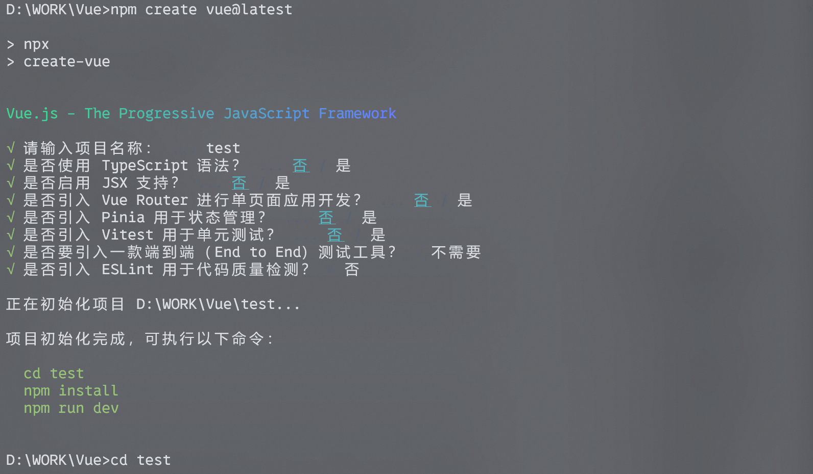
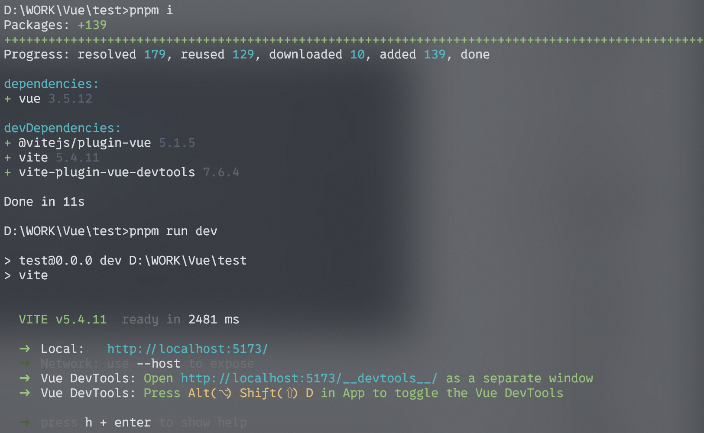
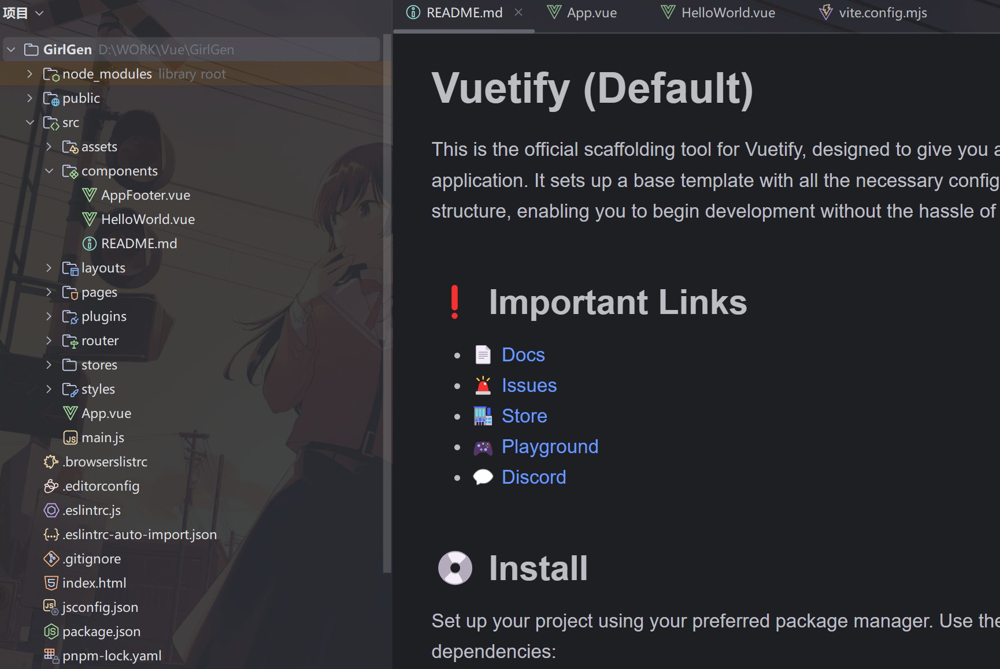
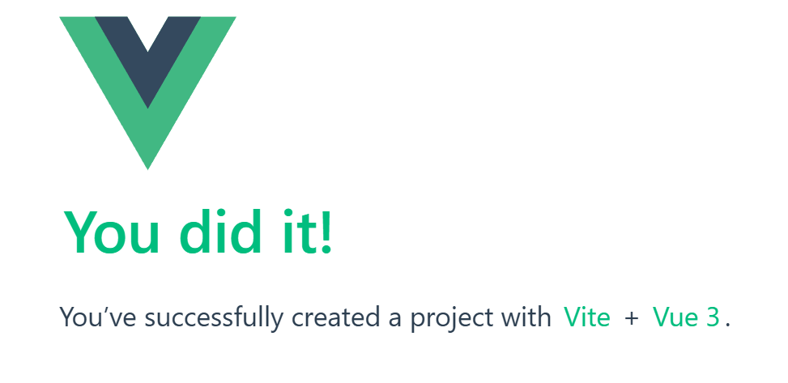

# Week 4 前端：Vue.js 组件基础

## 1. 欢迎来到Vue.js的世界

Vue.js 是一个功能强大且易于上手的前端框架，适合构建用户交互界面。Vue的核心特点是简洁、高效、灵活，特别适合初学者快速上手。本周的目标是让大家初步理解Vue的基本概念和工作方式，并通过实际动手操作，掌握如何在项目中使用Vue。

---

### 学习目标

* 了解Vue项目的基本结构和文件作用
* 掌握Vue组件的三大核心部分：模板、脚本和样式
* 理解Vue的数据绑定和事件处理
* 使用Vue实现一个简单的按钮计数器

---

## 2. Vue API 介绍

在开始Vue项目之前，我们需要了解两种Vue API的基本概念，这将帮助我们更好地理解不同的编码方式。

### 选项式 API（Options API）

选项式API是Vue的传统写法，结构清晰，代码通过`data`​、`methods`​、`computed`​等选项来组织。每个部分都明确分开，非常适合初学者，因为它让人一眼就能看出数据、方法等内容的结构。

```vue
<script>
export default {
  data() {
    return { count: 0 }
  },
  methods: {
    increment() {
      this.count++
    }
  }
}
</script>
```

### 组合式 API（Composition API）

组合式API是一种更灵活的写法，通过`setup`​函数将逻辑组合在一起。它的灵活性更强，更适合大型项目，因为可以方便地重用代码。但由于结构更灵活，对新手来说会有些复杂。本次教程暂不深入组合式API。

```vue
<script setup>
import { ref } from 'vue'

const count = ref(0)
function increment() {
  count.value++
}
</script>
```

### 本次教程选择的API

在本教程中，我们将使用选项式API。这种写法更适合新手上手，并且与传统的前端开发方式相似，帮助大家更快地理解Vue的基础。

---

## 3. Vue 项目引入方式

Vue可以通过多种方式引入，我们会介绍以下两种方法：

### 方法一：通过CDN引入（适合简单测试）

这种方法适合快速测试Vue的功能，无需安装任何工具。直接在HTML文件中引用Vue的CDN链接即可。

#### 步骤：

1. 创建一个HTML文件，命名为`index.html`​，并添加以下内容：

    ```html
    <!DOCTYPE html>
    <html lang="en">
    <head>
      <meta charset="UTF-8">
      <meta name="viewport" content="width=device-width, initial-scale=1.0">
      <title>Vue CDN Example</title>
      <!-- 引入Vue的CDN链接 -->
      <script src="https://unpkg.com/vue@3"></script>
    </head>
    <body>
      <div id="app">
        {{ message }}
      </div>

      <script>
        // 使用Vue创建应用
        const app = Vue.createApp({
          data() {
            return {
              message: 'Hello, Vue!'
            }
          }
        })
        // 挂载Vue应用到页面的#app元素
        app.mount('#app')
      </script>
    </body>
    </html>
    ```
2. 保存文件并打开该HTML文件，你会看到“Hello, Vue!”的输出。

#### 说明

* 我们在`<head>`​标签中通过CDN引入Vue的库。
* 使用`Vue.createApp`​创建一个Vue应用，并定义数据。
* 通过`app.mount('#app')`​将Vue实例挂载到`<div id="app">`​上，渲染其中的数据。

### 方法二：通过Node.js和NPM创建项目（推荐）

在实际项目中，我们通常使用Node.js和NPM来创建Vue项目。这种方式能更好地管理项目的依赖和构建流程。接下来，我们将带大家一步步创建一个Vue项目。

---

## 4. 使用Node.js和NPM创建Vue项目

### 第一步：安装Node.js和NPM

Vue项目需要Node.js的支持。我们首先需要下载并安装Node.js，Node.js会自带NPM（包管理工具），帮助我们管理项目的依赖。

1. 打开[Node.js官网](https://nodejs.org/)下载并安装最新的LTS版本。
2. 安装完成后，打开命令行（Windows系统使用“命令提示符”或“PowerShell”，MacOS系统使用“终端”）。
3. 输入以下命令以确保Node.js和NPM安装成功：

    ```bash
    node -v
    npm -v
    ```

### 第二步：创建Vue项目

1. 在命令行中输入以下命令，创建一个新的Vue项目：

    ```bash
    npm create vue@latest
    ```
2. 然后会提示你输入项目名称，比如`vue-demo`​。输入项目名称并按回车。
3. 接下来，会有一系列选项，推荐选择如下：

    * Vue版本：选择Vue 3。
    * 是否使用TypeScript：选择“No”。
    * 其他选项默认即可（按回车继续）。
4. 等待安装完成后，进入项目文件夹：

    ```bash
    cd vue-demo
    ```

    ​​
5. **<u>安装所需的包</u>**并且**<u>启动开发服务器</u>**：

    ```bash
    pnpm i
    pnpm run dev
    ```
6. 运行后，命令行会输出一个地址，比如`http://localhost:3000`​。在浏览器中打开这个地址，你会看到Vue的默认欢迎页面。

    ​​

### 项目结构简介

打开项目的`vue-demo`​文件夹，你会看到如下目录结构：

* ​`src`​文件夹：存放主要代码，包括组件和样式等。
* ​`main.js`​：项目的入口文件，负责引入根组件`App.vue`​并将应用挂载到页面。
* ​`App.vue`​：项目的根组件。
* ​`components`​文件夹：用于存放自定义组件。
* ​`public`​文件夹：存放静态资源和HTML模板文件。

​​

---

## 5. Vue组件的三大组成部分

在Vue中，组件通常包含三个部分：模板、脚本和样式。这些部分分别用来定义组件的结构、逻辑和样式。我们将在项目的根组件 `App.vue`​ 文件中对这三部分进行详细介绍。

### 打开 `App.vue`​ 文件

在`src`​文件夹中找到`App.vue`​文件，这是项目的根组件文件。双击打开，你会看到以下内容：

```vue
<script setup>
import HelloWorld from './components/HelloWorld.vue'
import TheWelcome from './components/TheWelcome.vue'
</script>

<template>
  <header>
    

    <div class="wrapper">
      <HelloWorld msg="You did it!" />
    </div>
  </header>

  <main>
    <TheWelcome />
  </main>
</template>

<style scoped>
header {
  line-height: 1.5;
}

.logo {
  display: block;
  margin: 0 auto 2rem;
}

@media (min-width: 1024px) {
  header {
    display: flex;
    place-items: center;
    padding-right: calc(var(--section-gap) / 2);
  }

  .logo {
    margin: 0 2rem 0 0;
  }

  header .wrapper {
    display: flex;
    place-items: flex-start;
    flex-wrap: wrap;
  }
}
</style>
```

### 组件的三大部分详解

1. 模板（`<template>`​）：

    * 这是组件的HTML部分，用于定义组件的结构。
    * 模板中可以使用双花括号 `{{ }}`​ 来绑定数据。比如，这里的`{{ msg }}`​会显示`data`​中的`msg`​内容。
2. 脚本（`<script>`​）：

    * 脚本部分定义组件的逻辑，包括数据、方法、事件处理、生命周期等内容。
    * 在这里，`data`​函数返回一个对象，其中`msg`​属性存储了需要在页面中显示的数据。
3. 样式（`<style>`​）：

    * 样式部分用于定义组件的CSS样式，使组件更加美观。
    * 这里的样式定义了`h1`​标签的颜色为Vue的标志性颜色`#42b983`​。

### 保存并查看效果

​​

编辑完`App.vue`​文件后，例如将`You did it!`​修改为`我运行了我的第一个Vue项目`​，保存，等待自动刷新或手动在浏览器中刷新页面，你将看到页面上显示修改后字样。Vite会自动热重载被你修改过的文件而你无需每次都重新开启开发服务器。

## 6. 初识Vue：按钮计数器示例

### 樱宁宁的第一个Vue项目

剧情背景：樱宁宁是凉风青叶的高中同学，对编程有浓厚的兴趣。为了学习Vue，她来到了青叶所在的公司“飞鹰跃动”做兼职。青叶建议宁宁从一个简单的按钮计数器开始，体验Vue的基本功能和简单语法。

​​

### 实现步骤

1. 清空原有内容并添加新的代码：

    * 打开`src/App.vue`​文件。
    * 将文件内容替换为以下代码：

    ```vue
    <template>
      <div>
        <button @click="incrementCount">点击次数：{{ displayText }}</button>
        <p v-if="count > 0">您已经点击了 {{ count }} 次！</p>
        <p v-else>请点击按钮吧！</p>
      </div>
    </template>

    <script>
    export default {
      data() {
        return {
          count: 0 // 初始计数值
        };
      },
      computed: {
        displayText() {
          return this.count > 0 ? `点击次数：${this.count}` : "请点击我吧";
        }
      },
      methods: {
        incrementCount() {
          this.count++; // 每次点击按钮，计数增加1
        }
      }
    };
    </script>

    <style>
    button {
      padding: 10px;
      font-size: 16px;
      color: #fff;
      background-color: #42b983;
      border: none;
      border-radius: 5px;
      cursor: pointer;
    }
    p {
      font-size: 18px;
      color: #333;
    }
    </style>
    ```

---

### 代码详解

我们将逐步讲解这段代码中的每个部分，方便大家理解Vue的基本语法和功能。

#### 模板部分（`<template>`​）

* `<template>`​ 标签：Vue组件的模板部分，用于定义页面的结构和显示内容。模板中包含HTML代码以及Vue的指令和语法。
* 插值表达式 `{{ }}`​：`{{ displayText }}`​ 是Vue的插值语法，用于将数据绑定到页面上显示。在这里，`displayText`​ 是一个计算属性，用于根据 `count`​ 的值显示不同的文本。
* 事件绑定 `@click="incrementCount"`​：

  * ​`@click`​ 是 Vue 的事件绑定指令，用于监听点击事件，相当于 `v-on:click`​ 的简写。
  * 当按钮被点击时，会触发 `incrementCount`​ 方法。
* 条件渲染 `v-if`​ 和 `v-else`​：

  * ​`v-if`​ 和 `v-else`​ 是 Vue 提供的条件渲染指令。
  * ​`v-if="count > 0"`​：当 `count`​ 的值大于0时，显示“您已经点击了 … 次！”的内容。
  * ​`v-else`​：当 `count`​ 为0时，显示“请点击按钮吧！”的提示。
  * 这两个指令一起实现了点击前后的不同提示显示。

#### 脚本部分（`<script>`​）

* `export default {}`​：Vue组件的定义部分，使用 ES6 模块语法导出组件。所有的组件内容（数据、方法、计算属性等）都写在这个对象中。
* `data()`​ 函数：

  * ​`data`​ 是一个返回数据对象的函数，用于定义组件的状态。
  * 在 Vue 的选项式API中，`data`​ 必须是一个函数，该函数返回一个对象。在这里我们定义了 `count`​ 属性，初始值为 `0`​。
  * ​`count`​ 变量用于存储点击次数，每次点击按钮时会自增。
* `computed`​ 对象：

  * ​`computed`​ 用于定义计算属性（computed properties），这些属性会根据依赖的数据自动更新。
  * ​`displayText`​：这是一个计算属性，返回不同的字符串。通过 `this.count > 0 ? "点击次数：" + this.count : "请点击我吧"`​，我们可以根据 `count`​ 的值来动态调整显示内容。
  * 计算属性在很多场景下比方法更合适，因为它们具有缓存功能，只有依赖的数据变化时才会重新计算。
* `methods`​ 对象：

  * ​`methods`​ 用于定义方法，方法是组件的行为处理逻辑。
  * ​`incrementCount()`​ 方法：这个方法在每次点击按钮时调用，通过 `this.count++`​ 将 `count`​ 的值增加 1，并触发视图更新。

#### 样式部分（`<style>`​）

* `<style>`​ 标签：用于定义组件的样式。我们可以在此设置组件的 CSS 样式，让页面更加美观。
* 按钮样式：

  * ​`button`​ 选择器：为按钮设置了样式，包括内边距、字体大小、字体颜色、背景颜色、圆角边框等。
  * ​`cursor: pointer;`​：将鼠标悬停在按钮上时的指针样式设为手型，增强用户体验。
* 文本样式：

  * ​`p`​ 选择器：为段落文本设置了基本样式，包括字体大小和颜色，使内容更易于阅读。

### Vue 的基本语法与绑定

在上面的例子中，我们初步接触了Vue的几个重要语法：

1. 数据绑定 `{{ }}`​：使用双花括号插值语法，可以将数据绑定到页面上。Vue会根据数据的变化，自动更新页面上的内容。
2. 事件绑定 `@click`​：通过事件绑定指令 `@click`​，可以让元素在用户交互时触发方法，响应用户的点击操作。
3. 计算属性 `computed`​：计算属性是基于依赖数据自动计算的属性，具有缓存功能，非常适合处理需要根据数据动态变化的内容。与方法不同，计算属性只会在依赖的数据变化时重新计算。
4. 条件渲染 `v-if`​ 和 `v-else`​：Vue的条件渲染指令让我们可以根据条件的真伪，动态显示或隐藏页面元素，丰富了页面的动态效果。

### 保存并查看效果

1. 在编辑器中，点击保存。
2. 回到浏览器，刷新页面。初始状态下，按钮上会显示“请点击我吧”。
3. 每次点击按钮时，按钮上的数字会递增，同时页面会显示“您已经点击了 X 次！”的提示。

通过这个示例，我们学习了Vue的基本语法和功能，包括数据绑定、事件处理、计算属性和条件渲染。Vue的这些功能使得页面内容可以随着数据的变化而动态更新，不需要手动操作DOM。这种响应式的数据绑定让开发过程更加简洁和高效。

:::tip

拓展阅读：如何使用 `v-bind`​ 绑定一个属性呢，例如动态绑定按钮的颜色？

* 答案：Vue 提供 `v-bind`​ 指令用于绑定HTML属性，语法为 `:属性名="表达式"`​。

:::

## 7. Vue 组件之间的数据传递

在实际开发中，一个应用往往包含多个组件，而这些组件需要相互传递数据。Vue.js 提供了**Props**和**事件**来实现父子组件之间的数据通信。

### 父组件向子组件传递数据（Props）

在Vue中，父组件可以通过 **Props** 向子组件传递数据。Props是组件的输入参数，类似于函数的参数，父组件可以将数据传递给子组件进行使用。

#### 示例：父组件向子组件传递消息

1. 在`src/components`​文件夹中创建一个新的组件文件，命名为 `ChildComponent.vue`​。
2. 在`ChildComponent.vue`​文件中，添加以下代码：

    ```vue
    <template>
      <div>
        子组件收到的消息：{{ message }}
      </div>
    </template>

    <script>
    export default {
      props: {
        message: String // 接收来自父组件的消息
      }
    };
    </script>
    ```
3. 修改 `App.vue`​ 文件，将 `ChildComponent`​ 作为子组件引入：

    ```vue
    <template>
      <div>
        <ChildComponent message="Hello from Parent"/>
      </div>
    </template>

    <script>
    import ChildComponent from './components/ChildComponent.vue';

    export default {
      components: {
        ChildComponent
      }
    };
    </script>
    ```

#### 说明

* ​`ChildComponent.vue`​ 使用 `props`​ 接收父组件传递的数据。在 `props`​ 中定义 `message`​，类型为`String`​。
* 在 `App.vue`​ 中，通过属性绑定的方式向 `ChildComponent`​ 传递 `message`​ 属性。
* ​`ChildComponent`​ 接收到 `message`​ 后，会显示在页面上。

### 父子组件之间的数据传递：实际开发中的场景和示例

在实际开发中，父子组件之间的数据传递是非常常见的需求。Vue.js提供的**Props**和**事件机制**可以帮助我们实现组件间的数据传递和响应，使得组件能够有效地进行信息交换。

#### 场景一：商品列表与商品详情

在一个电子商务网站中，通常会有一个商品列表页面。父组件可能是整个商品列表，而每个商品则由子组件表示。在这种情况下，父组件会将每个商品的数据（如名称、价格、图片等）通过**Props**传递给子组件。每个商品子组件可以独立显示其数据，并实现点击查看详情、加入购物车等操作。

#### 示例

1. **父组件**：商品列表

    ```vue
    <template>
      <div>
        <ProductCard
          v-for="product in products"
          :key="product.id"
          :product="product"
        />
      </div>
    </template>

    <script>
    import ProductCard from './ProductCard.vue';

    export default {
      components: { ProductCard },
      data() {
        return {
          products: [
            { id: 1, name: '商品A', price: 100 },
            { id: 2, name: '商品B', price: 200 },
          ]
        };
      }
    };
    </script>
    ```
2. **子组件**：`ProductCard`​ 组件，用于显示单个商品的信息

    ```vue
    <template>
      <div>
        <h2>{{ product.name }}</h2>
        <p>价格: {{ product.price }}</p>
        <button @click="addToCart">加入购物车</button>
      </div>
    </template>

    <script>
    export default {
      props: {
        product: Object
      },
      methods: {
        addToCart() {
          this.$emit('add-to-cart', this.product);
        }
      }
    };
    </script>
    ```

在这个示例中，父组件通过 `product`​ Prop 将商品数据传递给 `ProductCard`​ 子组件。子组件接收到数据后，在页面上展示商品信息，并可以通过点击按钮触发 `add-to-cart`​ 事件，将商品信息传递回父组件。这种数据传递方式使得父组件和子组件可以专注于各自的逻辑，组件代码更加清晰、可维护。

#### 场景二：表单输入与提交

在一个表单组件中，我们可能需要将用户输入的数据传递给父组件，以便父组件进行数据处理、验证或提交到服务器。在这种情况下，表单每个字段可以作为子组件，父组件负责汇总和处理数据。比如，注册页面中的“用户名”、“邮箱”和“密码”字段可以作为子组件，父组件收集并最终提交表单数据。

通过以上例子可以看到，父子组件的数据传递能够让组件更具模块化和可复用性，使代码更加结构化、清晰明了。

---

### 本周结语

恭喜你完成了本周的学习！在本周中，我们一起探索了Vue.js的基础知识，理解了Vue组件的三大组成部分（模板、脚本、样式），并动手实践了一个简单的按钮计数器示例。此外，我们还了解了父子组件之间的数据传递方法，包括通过**Props**向子组件传递数据和通过**事件**让子组件向父组件发送消息。

Vue.js作为一个渐进式的框架，非常适合初学者入门，并且能够随着你技能的提升而灵活地适应更复杂的项目。通过本周的学习，相信你已经掌握了Vue的基本使用方式，理解了如何创建和复用组件，以及组件之间的通信方法。这些知识将为你在前端开发中的组件化思维和模块化编程打下良好的基础。

在接下来的学习中，我们会逐步深入，探索更多Vue.js的功能与特性，学习如何在真实项目中应用这些知识。希望你能继续保持热情，通过不断的练习和探索，成为一名优秀的前端开发者！
