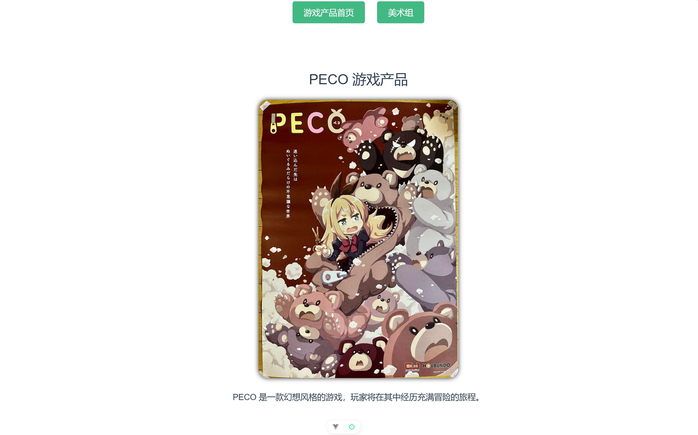
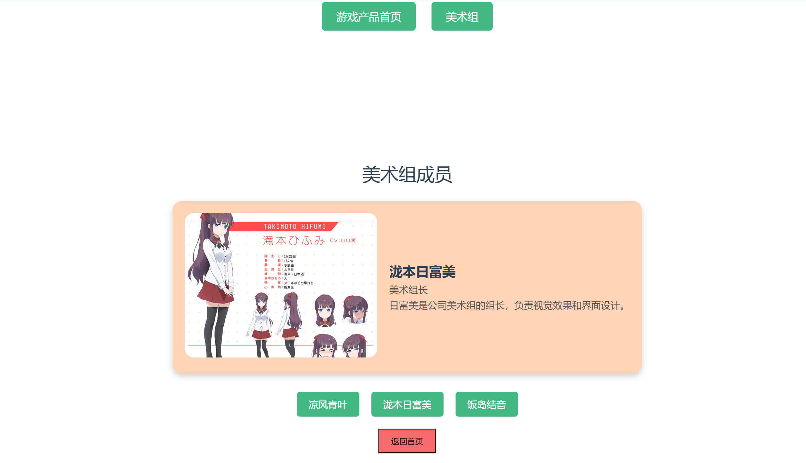

# Lab: 实现带有动态人物卡片的路由导航

首先，点击[此处](pic.zip)下载需要的素材文件。

## 1. 项目需求

* 首页 (主页)：顶部有两个按钮：

  * 游戏产品首页：跳转到 `Game.vue`​ 页面。
  * 美术组：跳转到 `Person.vue`​ 页面。
* 人员介绍页面 (`Person.vue`​)：

  * 页面展示一个人物卡片，卡片的内容（如姓名、职位、简介）和颜色是动态绑定的。
  * 有三个按钮，分别展示三个人物的信息：凉风青叶、泷本日富美、饭岛结音。
  * 用户点击按钮时，人物信息和卡片颜色会变化。

---

## 2. 项目结构

下面是项目文件的目录结构：

```
/src
  /assets
    - peco-game.jpg          # 游戏产品图片
    - person-image-1.jpg     # 凉风青叶的头像
    - person-image-2.jpg     # 泷本日富美的头像
    - person-image-3.jpg     # 饭岛结音的头像
  /components
    - Main.vue               # 主要组件，包含导航按钮
    - Game.vue               # 游戏产品页面组件
    - Person.vue             # 美术组页面组件，包含人物卡片展示
  /router
    - index.js               # 路由配置文件
  App.vue                    # 根组件
  main.js                    # 项目入口文件
```

---

## 3. 安装 Vue Router

在使用 Vue CLI 创建项目时，选择 router 配置（这个步骤无需使用 `install`​ 命令）。

假设你在创建项目时选择了 `vue-router`​，你可以直接在项目中使用路由功能。以下是配置步骤：

---

## 4. 配置路由

首先，确保在 `src/router/index.js`​ 中配置了两个路由：一个用于 `Game.vue`​，另一个用于 `Person.vue`​。此文件是负责管理页面路由的地方。

```js
import { createRouter, createWebHistory } from 'vue-router';
import Game from '../components/Game.vue';  // 游戏产品页面
import Person from '../components/Person.vue';  // 美术组页面

const routes = [
  {
    path: '/game',
    name: 'Game',
    component: Game
  },
  {
    path: '/person',
    name: 'Person',
    component: Person
  }
];

const router = createRouter({
  history: createWebHistory(),
  routes
});

export default router;
```

---

## 5. 配置 `App.vue`​ 根组件

在 `App.vue`​ 文件中，设置 `router-view`​ 用于显示不同的路由内容，并创建导航按钮来切换页面。

```html
<!-- /src/App.vue -->
<template>
  <div id="app">
    <!-- 导航按钮 -->
    <div class="nav-buttons">
      <router-link to="/game">
        <button>游戏产品首页</button>
      </router-link>
      <router-link to="/person">
        <button>美术组</button>
      </router-link>
    </div>
    <!-- 根据当前路由显示不同的组件 -->
    <div class="content">
      <router-view></router-view>
    </div>
  </div>
</template>

<script>
export default {
  name: 'App'
};
</script>

<style scoped>


#app {
  display: flex;
  flex-direction: column;
  justify-content: center;
  align-items: center;
  width: 100vw;
  height: 100vh;
  font-family: 'Arial', sans-serif;
  text-align: center;
}

.nav-buttons {
  display: flex;
  justify-content: center;
  gap: 20px;
  margin-bottom: 20px; 
}

.content {
  flex: 1; 
  display: flex;
  justify-content: center;
  align-items: center;
}

button {
  padding: 12px 24px;
  font-size: 18px;
  color: white;
  background-color: #42b983;
  border: none;
  border-radius: 5px;
  cursor: pointer;
}

button:hover {
  background-color: #35495e;
}
</style>
```

---

## 6. 创建 `Game.vue`​ 组件

这个组件展示游戏产品的基本信息，用户点击 游戏产品首页 按钮时会跳转到这个页面。

​​

```html
<!-- /src/components/Game.vue -->
<template>
  <div class="game">
    <h1>PECO 游戏产品</h1>
    
    <p>PECO 是一款幻想风格的游戏，玩家将在其中经历充满冒险的旅程。</p>
  </div>
</template>

<script>
export default {
  name: 'Game'
};
</script>

<style scoped>
.game {
  text-align: center;
}

.game-img {
  width: 430px;
  height: 600px;
  border-radius: 20px;
  margin-top: 20px;
  box-shadow: #222222 0 0 10px;
}

p {
  font-size: 18px;
  margin-top: 20px;
}
</style>
```

---

## 7. 创建 `Person.vue`​ 组件

在 `Person.vue`​ 中，我们将展示美术组成员的卡片，并使用按钮切换人物信息和卡片颜色。

​​

```html
<template>
  <div class="person">
    <h1>美术组成员</h1>

    <!-- 人物卡片 -->
    <div class="card" :style="{ backgroundColor: cardColor }">
      <div class="avatar-container">
        
      </div>
      <div class="info">
        <h2>{{ currentPerson.name }}</h2>
        <p>{{ currentPerson.title }}</p>
        <p>{{ currentPerson.description }}</p>
      </div>
    </div>

    <!-- 按钮切换人物 -->
    <div class="buttons">
      <button @click="switchPerson('青叶')">凉风青叶</button>
      <button @click="switchPerson('日富美')">泷本日富美</button>
      <button @click="switchPerson('结音')">饭岛结音</button>
    </div>

    <router-link to="/game">
      <button class="back-button">返回首页</button>
    </router-link>
  </div>
</template>

<script>
import personImage1 from '../assets/person-image-1.jpg';
import personImage2 from '../assets/person-image-2.jpg';
import personImage3 from '../assets/person-image-3.jpg';

export default {
  name: 'Person',
  data() {
    return {
      // 定义三个人物的数据
      persons: {
        青叶: {
          name: '凉风青叶',
          title: '前端开发',
          description: '青叶是游戏公司"飞鹰跃动"的前端开发者，负责产品页面的实现。',
          image: personImage1,
        },
        日富美: {
          name: '泷本日富美',
          title: '美术组长',
          description: '日富美是公司美术组的组长，负责视觉效果和界面设计。',
          image: personImage2,
        },
        结音: {
          name: '饭岛结音',
          title: '美术设计师',
          description: '结音是美术组的设计师，负责游戏中的人物和场景设计。',
          image: personImage3,
        }
      },
      currentPerson: {},
      cardColor: '#ffffff', // 默认卡片颜色
    };
  },
  methods: {
    switchPerson(personKey) {
      this.currentPerson = this.persons[personKey];
      // 根据不同人物切换卡片背景颜色
      if (personKey === '青叶') {
        this.cardColor = '#bde0fe'; // 青叶的卡片颜色
      } else if (personKey === '日富美') {
        this.cardColor = '#ffd3b6'; // 日富美的卡片颜色
      } else if (personKey === '结音') {
        this.cardColor = '#d4f1c7'; // 结音的卡片颜色
      }
    }
  },
  mounted() {
    // 默认显示青叶的信息
    this.switchPerson('青叶');
  }
};
</script>

<style scoped>
.person {
  text-align: center;
}

.card {
  position: relative;
  display: flex;
  align-items: center;
  padding: 20px 20px 20px 0;
  border-radius: 15px;
  box-shadow: 0px 4px 10px rgba(0, 0, 0, 0.2);
  margin-top: 20px;
  overflow: hidden;
}

.avatar-container {
  position: relative;
  margin-right: 20px;
  margin-left: 20px;
}

.card .avatar {
  width: 320px;
  height: 240px;
  border-radius: 15px;
  object-fit: cover;
}

.card .info {
  text-align: left;
  flex: 1;
}

.card .info h2 {
  font-size: 22px;
  font-weight: bold;
}

.card .info p {
  font-size: 16px;
  color: #555;
}

.buttons {
  margin-top: 30px;
}

.buttons button {
  padding: 10px 20px;
  font-size: 16px;
  color: white;
  background-color: #42b983;
  border: none;
  border-radius: 5px;
  cursor: pointer;
  margin: 0 10px;
}

.buttons button:hover {
  background-color: #35495e;
}

.back-button {
  margin-top: 20px;
  padding: 10px 20px;
  background-color: #f76c6c;
}

.back-button:hover {
  background-color: #e04e4e;
}
</style>
```

---

## 8. 配置入口文件 `main.js`​

在 `main.js`​ 中挂载 Vue 实例，并引入路由配置。

```js
import './assets/main.css'

import { createApp } from 'vue'
import App from './App.vue'
import router from './router'

const app = createApp(App)

app.use(router)

app.mount('#app')

```


## 9. 总结

在这个实验中，你学会了如何利用 Vue Router 实现页面之间的跳转，如何动态展示人物卡片，并通过按钮切换不同人物的信息。通过绑定样式，我们实现了页面和组件的美观设计，确保用户体验良好。

