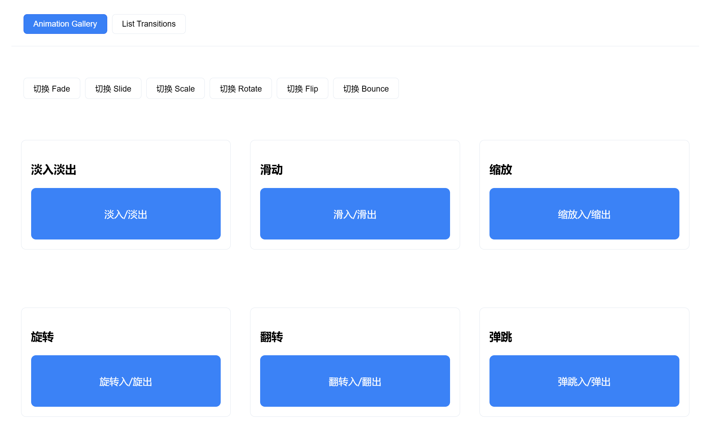
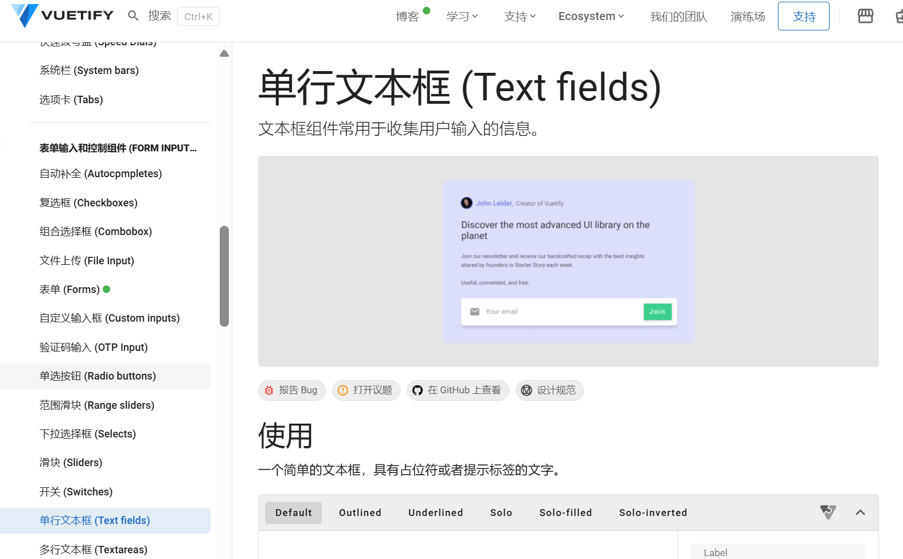
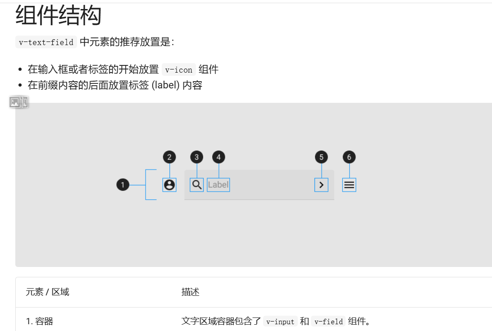
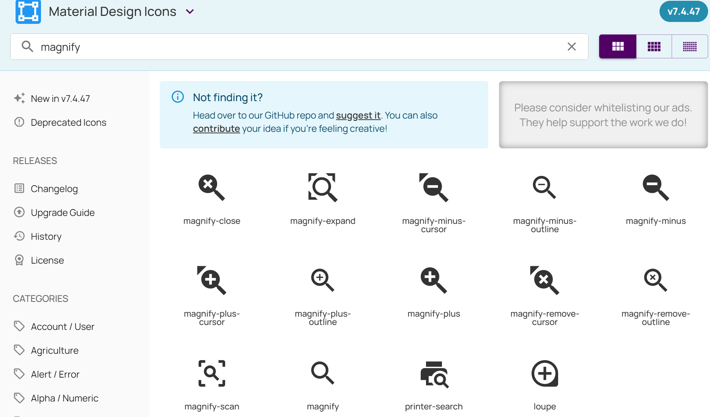
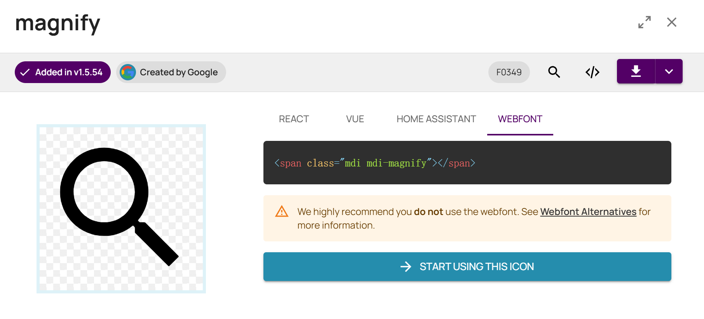
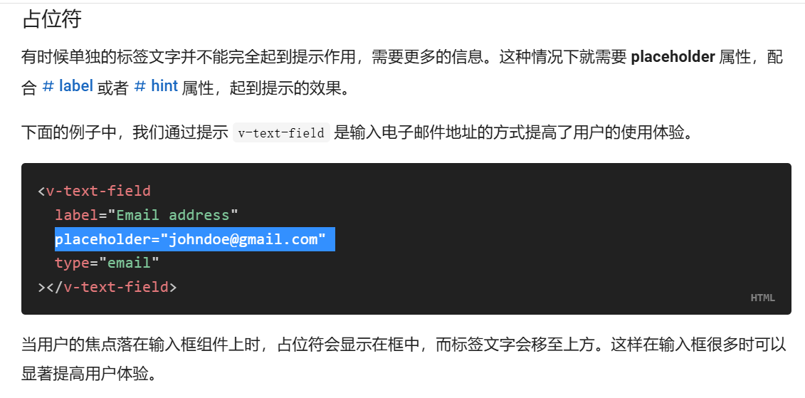
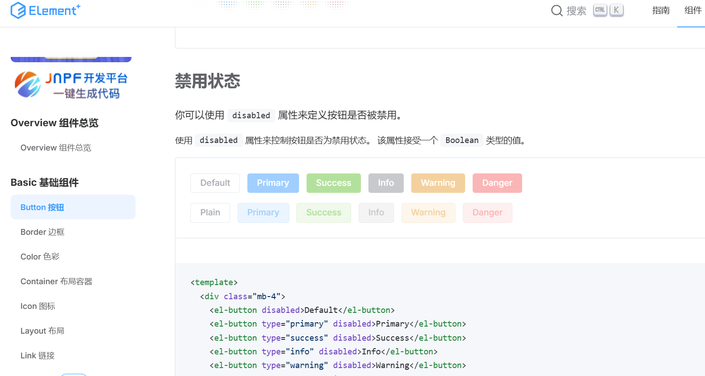
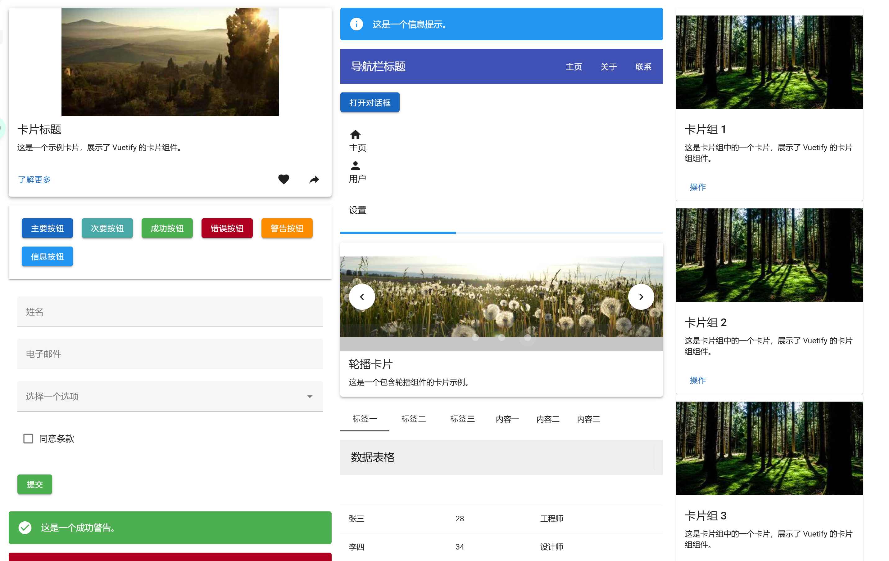

# Doc

本周主要讲解如何制作快速现代化的界面，并添加动画和过渡效果。

## 圣诞夜

圣诞节到了，公司内充满了快活的空气，大家约好晚上一起去逛街。就在这时，社长上网的时候发现其他公司的页面都变成了红色+现代风格，而自家公司还是古董风。于是他要求青叶学一下怎么美化外观再下班。青叶从海子前辈口中得知组件库是搭建UI好东西。最后她快速完成了任务和并大家一起欣赏了圣诞夜的街景。

​​

## 动画和过渡效果

首先我们来看看什么是动画和过渡效果。在web开发中，动画和过渡效果是提高用户体验的重要手段。动画是指元素在一段时间内从一个状态平滑过渡到另一个状态，如元素的移动、旋转、缩放等；过渡效果是指元素在显示或隐藏时的平滑过渡，如淡入淡出、滑动、弹跳等。通过添加动画和过渡效果，可以使页面更加生动、有趣，提高用户的参与感和满意度。

我们接下来学习vue自带的一些动画效果和组件间切换的过渡效果。看下面一个演示例子，请在你的电脑上也跟着做一遍。

创建一个新的vue项目，`pnpm create vue@latest`​，然后删除自动创建的`/src/assets/main.css`​文件，以免干扰我们的页面样式。

​`components/`​目录下创建`Father.vue`​，`Son1.vue`​，`Son2.vue`​三个Vue组件，代码如下：

### Father.vue

```vue
<template>
    <div class="father">
      <nav class="nav">
        <button 
          v-for="tab in tabs" 
          :key="tab.name"
          @click="currentTab = tab.component"
          :class="['btn', currentTab === tab.component ? 'btn-primary' : '']"
        >
          {{ tab.name }}
        </button>
      </nav>
  
      <transition-group name="fade" mode="out-in">
        <component :is="currentTab" :key="currentTab" />
      </transition-group>
    </div>
  </template>
  
  <script>
  import Son1 from './Son1.vue'
  import Son2 from './Son2.vue'
  
  export default {
    name: 'Father',
    components: { Son1, Son2 },
    data() {
      return {
        currentTab: 'Son1',
        tabs: [
          { name: 'Animation Gallery', component: 'Son1' },
          { name: 'List Transitions', component: 'Son2' }
        ]
      }
    }
  }
  </script>
  
  <style scoped>
  .nav {
    margin-bottom: 2rem;
    padding: 1rem;
    border-bottom: 1px solid #e2e8f0;
  }
  
  .fade-enter-active,
  .fade-leave-active {
    transition: opacity 0.3s ease;
  }
  
  .fade-enter-from,
  .fade-leave-to {
    opacity: 0;
  }
  </style>
```

### Son1.vue

```vue
<!-- Son1.vue -->
<template>
  <div class="animation-gallery">
    <div class="controls">
      <button 
        v-for="(_, name) in animations" 
        :key="name"
        @click="toggleAnimation(name)"
        class="btn"
      >
        切换 {{ formatName(name) }}
      </button>
    </div>

    <div class="demos">
      <!-- 淡入淡出 -->
      <div class="demo-section">
        <h3>淡入淡出</h3>
        <transition name="fade">
          <div v-if="animations.fade" class="demo-box">
            淡入/淡出
          </div>
        </transition>
      </div>

      <!-- 滑动 -->
      <div class="demo-section">
        <h3>滑动</h3>
        <transition name="slide">
          <div v-if="animations.slide" class="demo-box">
            滑入/滑出
          </div>
        </transition>
      </div>

      <!-- 缩放 -->
      <div class="demo-section">
        <h3>缩放</h3>
        <transition name="scale">
          <div v-if="animations.scale" class="demo-box">
            缩放入/缩出
          </div>
        </transition>
      </div>

      <!-- 旋转 -->
      <div class="demo-section">
        <h3>旋转</h3>
        <transition name="rotate">
          <div v-if="animations.rotate" class="demo-box">
            旋转入/旋出
          </div>
        </transition>
      </div>

      <!-- 翻转 -->
      <div class="demo-section">
        <h3>翻转</h3>
        <transition name="flip">
          <div v-if="animations.flip" class="demo-box">
            翻转入/翻出
          </div>
        </transition>
      </div>

      <!-- 弹跳 -->
      <div class="demo-section">
        <h3>弹跳</h3>
        <transition name="bounce">
          <div v-if="animations.bounce" class="demo-box">
            弹跳入/弹出
          </div>
        </transition>
      </div>
    </div>
  </div>
</template>

<script>
export default {
  name: 'Son1',
  data() {
    return {
      animations: {
        fade: true,
        slide: true,
        scale: true,
        rotate: true,
        flip: true,
        bounce: true
      }
    }
  },
  methods: {
    toggleAnimation(name) {
      this.animations[name] = !this.animations[name]
    },
    formatName(name) {
      return name.charAt(0).toUpperCase() + name.slice(1)
    }
  }
}
</script>

<style scoped>
.animation-gallery {
  padding: 1rem;
}

.controls {
  margin-bottom: 2rem;
}

.demos {
  display: grid;
  grid-template-columns: repeat(auto-fit, minmax(300px, 1fr));
  gap: 2rem;
}

.demo-box {
  background: #3b82f6;
  color: white;
  padding: 2rem;
  border-radius: 0.5rem;
  text-align: center;
}

/* 淡入淡出 */
.fade-enter-active,
.fade-leave-active {
  transition: opacity 0.5s ease;
}

.fade-enter-from,
.fade-leave-to {
  opacity: 0;
}

/* 滑动 */
.slide-enter-active,
.slide-leave-active {
  transition: all 0.5s ease;
}

.slide-enter-from,
.slide-leave-to {
  transform: translateX(100%);
  opacity: 0;
}

/* 缩放 */
.scale-enter-active,
.scale-leave-active {
  transition: all 0.5s ease;
}

.scale-enter-from,
.scale-leave-to {
  transform: scale(0);
  opacity: 0;
}

/* 旋转 */
.rotate-enter-active,
.rotate-leave-active {
  transition: all 0.5s ease;
}

.rotate-enter-from,
.rotate-leave-to {
  transform: rotate(180deg);
  opacity: 0;
}

/* 翻转 */
.flip-enter-active,
.flip-leave-active {
  transition: all 0.5s ease;
}

.flip-enter-from,
.flip-leave-to {
  transform: perspective(400px) rotateY(90deg);
  opacity: 0;
}

/* 弹跳 */
.bounce-enter-active {
  animation: bounce-in 0.5s;
}
.bounce-leave-active {
  animation: bounce-in 0.5s reverse;
}
@keyframes bounce-in {
  0% {
    transform: scale(0);
  }
  50% {
    transform: scale(1.25);
  }
  100% {
    transform: scale(1);
  }
}
</style>
```

### Son2.vue

```vue
<template>
    <div class="list-demo">
      <div class="controls">
        <button @click="addItem" class="btn">添加项目</button>
        <button @click="removeItem" class="btn">移除项目</button>
        <button @click="shuffleItems" class="btn">打乱项目</button>
      </div>
  
      <div class="list-container">
        <transition-group name="list" tag="ul" class="demo-list">
          <li 
            v-for="item in items" 
            :key="item.id"
            class="list-item"
          >
            {{ item.text }}
            <button 
              @click="removeSpecificItem(item.id)"
              class="btn-remove"
            >
              ×
            </button>
          </li>
        </transition-group>
      </div>
    </div>
  </template>
  
  <script>
  export default {
    name: 'Son2',
    data() {
      return {
        nextId: 1,
        items: [
          { id: 0, text: '初始项目' }
        ]
      };
    },
    methods: {
      addItem() {
        this.items.push({ id: this.nextId++, text: `项目 ${this.nextId}` });
      },
      removeItem() {
        this.items.pop();
      },
      shuffleItems() {
        this.items = this.items.sort(() => Math.random() - 0.5);
      },
      removeSpecificItem(id) {
        this.items = this.items.filter(item => item.id !== id);
      }
    }
  };
  </script>
  
  <style scoped>
  .list-demo {
    padding: 1rem;
  }
  
  .demo-list {
    list-style: none;
    padding: 0;
    margin: 2rem 0;
  }
  
  .list-item {
    display: flex;
    justify-content: space-between;
    align-items: center;
    padding: 1rem;
    margin: 0.5rem 0;
    background: white;
    border: 1px solid #e2e8f0;
    border-radius: 0.5rem;
    transition: all 0.3s;
  }
  
  .list-item:hover {
    transform: translateX(5px);
    border-color: #3b82f6;
  }
  
  .btn-remove {
    padding: 0.25rem 0.5rem;
    border: none;
    background: none;
    color: #ef4444;
    cursor: pointer;
    font-size: 1.25rem;
  }
  
  /* 列表过渡效果 */
  .list-enter-active,
  .list-leave-active {
    transition: all 0.5s ease;
  }
  
  .list-enter-from {
    opacity: 0;
    transform: translateX(30px);
  }
  
  .list-leave-to {
    opacity: 0;
    transform: translateX(-30px);
  }
  
  /* 确保移动时的平滑过渡 */
  .list-move {
    transition: transform 0.5s ease;
  }
  </style>
```

### App.vue

```vue
<template>
  <div id="app">
    <Father />
  </div>
</template>

<script>
import Father from './components/Father.vue'

export default {
  name: 'App',
  components: {
    Father
  }
}
</script>

<style>
#app {
  font-family: 'Inter', -apple-system, BlinkMacSystemFont, sans-serif;
  -webkit-font-smoothing: antialiased;
  max-width: 1200px;
  margin: 0 auto;
  padding: 2rem;
}

.demo-section {
  margin: 2rem 0;
  padding: 1rem;
  border: 1px solid #e2e8f0;
  border-radius: 0.5rem;
}

.btn {
  padding: 0.5rem 1rem;
  margin: 0.25rem;
  border: 1px solid #e2e8f0;
  border-radius: 0.375rem;
  background: white;
  cursor: pointer;
  transition: all 0.2s;
}

.btn:hover {
  background: #f7fafc;
}

.btn-primary {
  background: #3b82f6;
  color: white;
  border-color: #2563eb;
}

.btn-primary:hover {
  background: #2563eb;
}
</style>
```

运行这个项目并按页面中的按钮来播放一下动画，体验一下过渡效果和动画效果。

在这里，我们为两个子组件的切换添加了淡入淡出的效果；在`Son1`​中演示了页面元素的旋转，滑动，弹跳等动画；在`Son2`​中演示了列表项添加、移除、移动时的动画效果。

​​

## 具体实现方式

### 1. 淡入淡出动画（Fade）

淡入淡出是最基本的动画效果之一，用于元素的出现和消失时的平滑过渡。在Vue中，我们可以使用`<transition>`​或`<transition-group>`​组件来实现这一效果。

实现步骤：

* 定义动画类： Vue的过渡机制依赖于CSS类来控制动画的开始和结束。对于淡入淡出效果，我们定义了`.fade-enter-active`​、`.fade-leave-active`​、`.fade-enter-from`​和`.fade-leave-to`​四个类。
* 设置过渡属性： 在`.fade-enter-active`​和`.fade-leave-active`​中，我们设置了`transition: opacity 0.5s ease;`​，这表示在进入和离开时，透明度将在0.5秒内平滑过渡。
* 控制透明度： `.fade-enter-from`​和`.fade-leave-to`​将元素的透明度设为0，确保元素在过渡开始时是透明的。

代码解读：

```css
/* 淡入淡出 */
.fade-enter-active,
.fade-leave-active {
  transition: opacity 0.5s ease;
}

.fade-enter-from,
.fade-leave-to {
  opacity: 0;
}
```

通过以上设置，当元素进入时，从透明度0逐渐变为1，实现淡入效果；当元素离开时，从透明度1逐渐变为0，实现淡出效果。

### 2. 滑动动画（Slide）

滑动动画用于元素在水平或垂直方向上的移动过渡。在本例中，我们实现了水平滑动效果。

实现步骤：

* 定义动画类： 类似于淡入淡出，我们定义了`.slide-enter-active`​、`.slide-leave-active`​、`.slide-enter-from`​和`.slide-leave-to`​。
* 设置过渡属性： 使用`transition: all 0.5s ease;`​使所有可过渡的属性在0.5秒内平滑过渡。
* 控制位置和透明度： 在`.slide-enter-from`​中，元素从`translateX(100%)`​和`opacity: 0`​开始，滑入视图；在`.slide-leave-to`​中，元素滑出视图并变得透明。

代码解读：

```css
/* 滑动 */
.slide-enter-active,
.slide-leave-active {
  transition: all 0.5s ease;
}

.slide-enter-from,
.slide-leave-to {
  transform: translateX(100%);
  opacity: 0;
}
```

当元素进入时，它会从右侧滑入；当元素离开时，它会向左侧滑出，同时透明度减少。

### 3. 缩放动画（Scale）

缩放动画使元素在进入或离开时放大或缩小，增加视觉动感。

实现步骤：

* 定义动画类： 定义`.scale-enter-active`​、`.scale-leave-active`​、`.scale-enter-from`​和`.scale-leave-to`​。
* 设置过渡属性： 使用`transition: all 0.5s ease;`​实现平滑过渡。
* 控制缩放和透明度： 在`.scale-enter-from`​中，元素从`scale(0)`​和`opacity: 0`​开始放大；在`.scale-leave-to`​中，元素缩小并变得透明。

代码解读：

```css
/* 缩放 */
.scale-enter-active,
.scale-leave-active {
  transition: all 0.5s ease;
}

.scale-enter-from,
.scale-leave-to {
  transform: scale(0);
  opacity: 0;
}
```

元素在进入时会从无到有逐渐放大至原始大小；在离开时则相反。

### 4. 旋转动画（Rotate）

旋转动画使元素在进入或离开时进行旋转，增加动态效果。

实现步骤：

* 定义动画类： 定义`.rotate-enter-active`​、`.rotate-leave-active`​、`.rotate-enter-from`​和`.rotate-leave-to`​。
* 设置过渡属性： 使用`transition: all 0.5s ease;`​。
* 控制旋转和透明度： 在`.rotate-enter-from`​中，元素从`rotate(180deg)`​和`opacity: 0`​开始旋转进入；在`.rotate-leave-to`​中，元素旋转180度并变得透明。

代码解读：

```css
/* 旋转 */
.rotate-enter-active,
.rotate-leave-active {
  transition: all 0.5s ease;
}

.rotate-enter-from,
.rotate-leave-to {
  transform: rotate(180deg);
  opacity: 0;
}
```

元素在进入时会旋转180度并逐渐显现；在离开时则旋转180度并逐渐消失。

### 5. 翻转动画（Flip）

翻转动画通过3D效果使元素在进入或离开时进行翻转，增强视觉冲击力。

实现步骤：

* 定义动画类： 定义`.flip-enter-active`​、`.flip-leave-active`​、`.flip-enter-from`​和`.flip-leave-to`​。
* 设置过渡属性： 使用`transition: all 0.5s ease;`​。
* 控制3D翻转和透明度： 在`.flip-enter-from`​中，元素从`perspective(400px) rotateY(90deg)`​和`opacity: 0`​开始翻转进入；在`.flip-leave-to`​中，元素翻转90度并变得透明。

代码解读：

```css
/* 翻转 */
.flip-enter-active,
.flip-leave-active {
  transition: all 0.5s ease;
}

.flip-enter-from,
.flip-leave-to {
  transform: perspective(400px) rotateY(90deg);
  opacity: 0;
}
```

通过设置`perspective`​和`rotateY`​，元素在进入和离开时实现3D翻转效果。

### 6. 弹跳动画（Bounce）

弹跳动画使元素在进入或离开时呈现弹跳效果，增加动感和趣味性。

实现步骤：

* 定义动画类： 定义`.bounce-enter-active`​和`.bounce-leave-active`​。
* 使用关键帧动画： 定义`@keyframes bounce-in`​，控制元素的缩放效果。
* 应用动画： 在`.bounce-enter-active`​中应用`bounce-in`​动画，在`.bounce-leave-active`​中应用反向的`bounce-in`​动画。

代码解读：

```css
/* 弹跳 */
.bounce-enter-active {
  animation: bounce-in 0.5s;
}
.bounce-leave-active {
  animation: bounce-in 0.5s reverse;
}
@keyframes bounce-in {
  0% {
    transform: scale(0);
  }
  50% {
    transform: scale(1.25);
  }
  100% {
    transform: scale(1);
  }
}
```

元素在进入时会先快速放大至1.25倍，然后回弹到原始大小；在离开时则反向执行相同动画。

通过以上六种动画效果，我们可以为网页元素添加丰富的视觉效果，提高用户体验。在实际开发中，可以根据需求灵活组合和调整这些动画效果，使界面更加生动和有趣。

## 组件库安装

然而，仅仅添加动画一般无法满足我们开发web应用的需求，这时候我们可以调用已有的第三方组件库。下面谈谈组件（按钮，输入框，导航栏，日期选择器，卡片，对话框等）、组件库是什么？别人写好的组件库有多方便？

组件，是指具有特定功能的独立模块，可以重复使用。这里的组件有别于Vue中的component，指的是界面上的一部分，如按钮、输入框、导航栏等。组件库，是指包含多个组件的合集，可以提供丰富的功能和样式，方便开发者快速构建页面。使用组件库的优势就在于，可以减少重复开发，提高开发效率，同时保证界面风格的一致性。

Vue中有很多优秀的组件库，如Element Plus、Vuetify、Ant Design Vue等是比较有名的，它们提供了丰富的组件和功能，和中文的详细文档，可以满足各种开发需求。下面我们以Vuetify为例，介绍如何使用组件库。

一般来说，组件库的安装有三种方法：组件库官方脚手架创建项目，包管理器安装并在已有的项目中使用，CDN引入。一般来说前两种用的比较多，我们下面一一介绍。

### 官方工具

以Vuetify为例，打开[Vuetify安装页面](https://vuetifyjs.com/zh-Hans/getting-started/installation/) 即可看到官方对这几种安装方式的介绍。如果要使用官方工具安装，我们执行下面的指令。

```sh
pnpm create vuetify
```

在向导中选择：不使用typescript，使用pnpm作为包管理器

​​

```sh
cd 你的项目名
pnpm dev
```

这样就能在项目中直接使用Vuetify提供的组件了。

### 包管理器

接下来是如何在已有项目里安装。在项目目录内执行：

```sh
pnpm i vuetify
```

在main.js里添加vuetify引入代码即可

```js
import { createApp } from 'vue'

// Vuetify
import 'vuetify/styles'
import { createVuetify } from 'vuetify'
import * as components from 'vuetify/components'
import * as directives from 'vuetify/directives'

import App from './App.vue'

const vuetify = createVuetify({
  components,
  directives,
})

createApp(App).use(vuetify).mount('#app')

```

### CDN引入

这种方式适合在简单的项目中使用，不需要安装包管理器，直接在 HTML 文件中引入 Vue 和 Vuetify 的 CDN 链接即可。这种方法并不常用。Vuetify 提供了 CDN 版本的样式和脚本，我们只需要在 HTML 文件中添加以下内容：

```html
<link href="https://cdn.jsdelivr.net/npm/vuetify@3.7.6/dist/vuetify.min.css" rel="stylesheet">
<script src="https://cdn.jsdelivr.net/npm/vue@3.2.37/dist/vue.global.js"></script>
<script src="https://cdn.jsdelivr.net/npm/vuetify@3.7.6/dist/vuetify.min.js"></script>
```

下面将通过一个简单的例子来展示如何在一个 HTML 文件中使用 Vuetify。

**1. 创建HTML 文件**

创建一个简单的 HTML 文件，通过 CDN 引入 Vue 和 Vuetify，在页面上显示一个 Vuetify 按钮。

```html
<!DOCTYPE html>
<html lang="en">
<head>
    <meta charset="UTF-8">
    <meta name="viewport" content="width=device-width, initial-scale=1.0">
    <title>Vuetify CDN 示例</title>
    <!-- 引入 Vuetify 的 CSS 样式 -->
    <link href="https://cdn.jsdelivr.net/npm/vuetify@3.7.6/dist/vuetify.min.css" rel="stylesheet">
</head>
<body>
    <!-- Vue 将会挂载到这个元素 -->
    <div id="app"></div>

    <!-- 引入 Vue 3 和 Vuetify 的 JavaScript -->
    <script src="https://cdn.jsdelivr.net/npm/vue@3.2.37/dist/vue.global.js"></script>
    <script src="https://cdn.jsdelivr.net/npm/vuetify@3.7.6/dist/vuetify.min.js"></script>

    <script>
        // 从 Vuetify 中获取所需的功能
        const { createApp } = Vue;
        const { createVuetify } = Vuetify;

        // 创建 Vuetify 实例
        const vuetify = createVuetify();

        // 定义一个简单的 Vue 组件，包含一个 Vuetify 按钮
        const Demo = {
            template: `
                <v-app>
                    <v-main>
                        <v-container>
                            <!-- 使用 Vuetify 的按钮组件 -->
                            <v-btn color="primary">Vuetify 按钮</v-btn>
                        </v-container>
                    </v-main>
                </v-app>
            `
        };

        // 创建 Vue 应用并使用 Vuetify
        createApp(Demo).use(vuetify).mount('#app');
    </script>
</body>
</html>
```

**2. 解析和说明**​

1. **引入 Vue 和 Vuetify：**

    * 在 `<head>`​ 中引入了 Vuetify 的 CSS 样式：

      ```html
      <link href="https://cdn.jsdelivr.net/npm/vuetify@3.7.6/dist/vuetify.min.css" rel="stylesheet">
      ```

    * 在 `<body>`​ 结束前引入了 Vue 和 Vuetify 的 JavaScript 文件：

      ```html
      <script src="https://cdn.jsdelivr.net/npm/vue@3.2.37/dist/vue.global.js"></script>
      <script src="https://cdn.jsdelivr.net/npm/vuetify@3.7.6/dist/vuetify.min.js"></script>
      ```

2. **创建 Vue 组件：**

    * 我们在 `<script>`​ 标签内定义了一个名为 `Demo`​ 的 Vue 组件。该组件使用了 Vuetify 的 `<v-btn>`​ 按钮组件，并设置了一个 `color="primary"`​ 属性，使按钮呈现主色调。
    * ​`v-app`​ 和 `v-main`​ 是 Vuetify 提供的布局组件，它们确保 UI 元素正确地布局和显示。
3. **创建 Vue 应用：**

    * 使用 `createApp(Demo).use(vuetify).mount('#app')`​ 创建 Vue 应用，并将其挂载到页面上的 `#app`​ 元素。

**3. 运行效果**

通过上述代码，在浏览器中打开 `index.html`​ 文件，你会看到一个主色调的 Vuetify 按钮，点击它会有波纹效果。

与此类似，element plus也提供了中文文档和包管理器安装、CDN引入的安装方式，步骤与上文几乎相同，请参阅[Element Plus 安装指南](https://element-plus.org/zh-CN/guide/installation.html)

‍

:::info

对于element plus，它提供了完整引入和按需引入两种方式，使用包管理器安装完后，请到[Element Plus 快速开始](https://element-plus.org/zh-CN/guide/quickstart.html) 查看 vite 中的引入两种方式。建议使用按需引入。

:::

## 使用组件

在项目中安装组件库后，我们接下来学习如何使用它。不同的组件库的语法细节有区别，我们需要随时查阅文档。下面以Vuetify为例子，来走一次添加一个组件到页面中的全流程。

:::info

Vuetify的新版本会默认启用暗色主题，在`src\plugins\vuetify.js`​中将`defaultTheme: 'dark'`​修改为`light`​即可。

:::

我们在项目自动生成的`src\components\HelloWorld.vue`​中来做练习，删掉文件内已有的`template`​。以一个查询功能为例，我们需要一个输入框和查询按钮。首先就是要在组件库中找到我们想要的组件。

在vuetify[文档](https://vuetifyjs.com/zh-Hans/components/) 左侧找到组件，下拉找到输入组件中的单行文本框，打开文档。

​​

文档展示了基本的输入框例子、代码和可用的插槽（可以让我们自己设置的选项）。

文档最顶部的演示代码告诉我们，一个最简单的输入框标签是：

```html
<v-text-field label="标签"></v-text-field>
```

接下来我们需要定制这个组件。假设我们希望输入框内部有放大镜图标，初始状态显示“搜索”，点击后显示“您想查找的是...”。整体风格简洁。

查阅文档中的“变体”部分，发现Solo样式比较美观，符合场景需求。点击右上角的“查看源代码”按钮，查看具体设置。

这样，我们可以确定变体的设置为：

```html
variant="solo"
```

下一步是添加搜索图标。阅读组件结构部分得知，输入框组件是允许我们在框内前部添加一个图标的，我们在此添加表示搜索的放大镜图标。

​​

接下来我们就可以阅读“图标”部分来查看实现方式和语法。在展示区找到我们要的效果，点击“查看源代码”按钮，发现在该位置添加图标的语法是：

```html
prepend-inner-icon="mdi-图标名字"
```

​​

Vuetify支持多种图标字体（可以理解成图标包），具体可以查看 [Vuetify 图标字体](https://vuetifyjs.com/zh-Hans/features/icon-fonts)。我们接下来用官方推荐的MDI图标。来到官网寻找放大镜图标：[MDI 图标库](https://pictogrammers.com/library/mdi/)

点击想要的图标，复制它的名字`mdi-magnify`​并填入我们刚才找到的语法中。

​​

​​

最后是添加占位文字“您想搜索的是...”。回到Vuetify文档，在目录中很容易找到相关语法。

```html
placeholder="文字内容"
```

​​

最后就是把这些参数组装起来放进文本框标签内，并把用户输入的内容和Vue值绑定。假设keyword用来保存用户输入的内容。

最终组件如下：

```html
<v-text-field
  v-model="keyword"
  variant="solo"
  prepend-inner-icon="mdi-magnify"
  placeholder="您想搜索的是..."
></v-text-field>
```

下一步添加搜索按钮或者添加任何组件的步骤都和上述过程一致，大体流程均为：根据业务需要选择合适的组件，在组件库中找到想要的组件，阅读基本写法，阅读该组件支持的各种高级选项并按需要设置。

​​

如果没有找到自己需要的组件，我们可以到npm仓库和GitHub等平台寻找其他开发者的包，或许会有惊喜。需要注意，组件库并不是万能的。

成熟的组件库为大部分组件提供了强大的API和插槽，几乎涵盖了大部分开发需求，非常灵活和强大。因此，阅读文档是非常值得的。

对于Element Plus等其他组件库，用法大同小异。下图展示了文档中详细的说明和使用示例。即使遇到尚不完善的组件库，也可以通过阅读官方代码片段了解组件的基本用法。

​​

# lab

接下来我们将实现一个组件画廊，展示Vuetify的一些组件。在`components/`​目录下创建`Gallery.vue`​文件，代码如下：

这是一个分为三列的页面，使用 CSS 的 columns 属性实现布局。内容是各种的被定制过的Vuetify组件。

```vue
<template>
  <v-container fluid>
    <div class="masonry">
      <!-- 卡片示例 -->
      <v-card class="masonry-item" elevation="4">
        <v-img src="https://picsum.photos/400/200?random=1" height="200px">
          <v-overlay :value="true">
            <v-btn color="white" @click="handleClick">点击查看</v-btn>
          </v-overlay>
        </v-img>
        <v-card-title>卡片标题</v-card-title>
        <v-card-text>
          这是一个示例卡片，展示了 Vuetify 的卡片组件。
        </v-card-text>
        <v-card-actions>
          <v-btn text color="primary">了解更多</v-btn>
          <v-spacer></v-spacer>
          <v-btn icon>
            <v-icon>mdi-heart</v-icon>
          </v-btn>
          <v-btn icon>
            <v-icon>mdi-share</v-icon>
          </v-btn>
        </v-card-actions>
      </v-card>

      <!-- 按钮示例 -->
      <v-sheet class="masonry-item pa-4" elevation="2">
        <v-btn color="primary" class="ma-2">主要按钮</v-btn>
        <v-btn color="secondary" class="ma-2">次要按钮</v-btn>
        <v-btn color="success" class="ma-2">成功按钮</v-btn>
        <v-btn color="error" class="ma-2">错误按钮</v-btn>
        <v-btn color="warning" class="ma-2">警告按钮</v-btn>
        <v-btn color="info" class="ma-2">信息按钮</v-btn>
      </v-sheet>

      <!-- 表单示例 -->
      <v-form class="masonry-item pa-4" elevation="2">
        <v-text-field label="姓名" required></v-text-field>
        <v-text-field label="电子邮件" type="email" required></v-text-field>
        <v-select
          label="选择一个选项"
          :items="['选项一', '选项二', '选项三']"
          required
        ></v-select>
        <v-checkbox label="同意条款" required></v-checkbox>
        <v-btn color="success" class="mt-4">提交</v-btn>
      </v-form>

      <!-- 警告示例 -->
      <v-alert type="success" class="masonry-item">这是一个成功警告。</v-alert>
      <v-alert type="error" class="masonry-item">这是一个错误警告。</v-alert>
      <v-alert type="warning" class="masonry-item">这是一个警告提示。</v-alert>
      <v-alert type="info" class="masonry-item">这是一个信息提示。</v-alert>

      <!-- 导航栏示例 -->
      <v-toolbar color="indigo" dark class="masonry-item">
        <v-toolbar-title>导航栏标题</v-toolbar-title>
        <v-spacer></v-spacer>
        <v-btn text>主页</v-btn>
        <v-btn text>关于</v-btn>
        <v-btn text>联系</v-btn>
      </v-toolbar>

      <!-- 对话框示例 -->
      <v-dialog v-model="dialog" max-width="500">
        <template v-slot:activator="{ on, attrs }">
          <v-btn color="primary" class="masonry-item" v-bind="attrs" v-on="on">打开对话框</v-btn>
        </template>
        <v-card>
          <v-card-title class="headline">对话框标题</v-card-title>
          <v-card-text>
            这是一个示例对话框，展示了 Vuetify 的对话框组件。
          </v-card-text>
          <v-card-actions>
            <v-spacer></v-spacer>
            <v-btn color="green darken-1" text @click="dialog = false">取消</v-btn>
            <v-btn color="green darken-1" text @click="dialog = false">确定</v-btn>
          </v-card-actions>
        </v-card>
      </v-dialog>

      <!-- 列表示例 -->
      <v-list class="masonry-item" dense>
        <v-list-item>
          <v-list-item-icon>
            <v-icon>mdi-home</v-icon>
          </v-list-item-icon>
          <v-list-item-content>
            <v-list-item-title>主页</v-list-item-title>
          </v-list-item-content>
        </v-list-item>
        <v-list-item>
          <v-list-item-icon>
            <v-icon>mdi-account</v-icon>
          </v-list-item-icon>
          <v-list-item-content>
            <v-list-item-title>用户</v-list-item-title>
          </v-list-item-content>
        </v-list-item>
        <v-list-item>
          <v-list-item-icon>
            <v-icon>mdi-settings</v-icon>
          </v-list-item-icon>
          <v-list-item-content>
            <v-list-item-title>设置</v-list-item-title>
          </v-list-item-content>
        </v-list-item>
      </v-list>

      <!-- 进度条示例 -->
      <v-progress-linear
        class="masonry-item"
        indeterminate
        color="blue"
      ></v-progress-linear>

      <!-- 卡片网格示例 -->
      <v-card class="masonry-item" elevation="3">
        <v-carousel cycle height="200px">
          <v-carousel-item
            v-for="i in 3"
            :key="i"
            :src="`https://picsum.photos/800/200?random=${i + 10}`"
          ></v-carousel-item>
        </v-carousel>
        <v-card-title>轮播卡片</v-card-title>
        <v-card-text>
          这是一个包含轮播组件的卡片示例。
        </v-card-text>
      </v-card>

      <!-- 标签页示例 -->
      <v-tabs class="masonry-item">
        <v-tab>标签一</v-tab>
        <v-tab>标签二</v-tab>
        <v-tab>标签三</v-tab>

        <v-tab-item>
          <v-card flat>
            <v-card-text>内容一</v-card-text>
          </v-card>
        </v-tab-item>
        <v-tab-item>
          <v-card flat>
            <v-card-text>内容二</v-card-text>
          </v-card>
        </v-tab-item>
        <v-tab-item>
          <v-card flat>
            <v-card-text>内容三</v-card-text>
          </v-card>
        </v-tab-item>
      </v-tabs>

      <!-- 数据表格示例 -->
      <v-data-table
        class="masonry-item"
        :headers="headers"
        :items="items"
        disable-pagination
        disable-sort
      >
        <template v-slot:top>
          <v-toolbar flat>
            <v-toolbar-title>数据表格</v-toolbar-title>
            <v-divider
              class="mx-4"
              inset
              vertical
            ></v-divider>
          </v-toolbar>
        </template>
      </v-data-table>

      <!-- 卡片组示例 -->
      <v-card-group class="masonry-item" column>
        <v-card
          v-for="n in 3"
          :key="n"
          class="mx-2"
          max-width="344"
        >
          <v-img
            src="https://picsum.photos/400/200?random=20"
            height="200px"
          ></v-img>
          <v-card-title>卡片组 {{ n }}</v-card-title>
          <v-card-text>
            这是卡片组中的一个卡片，展示了 Vuetify 的卡片组组件。
          </v-card-text>
          <v-card-actions>
            <v-btn text color="primary">操作</v-btn>
          </v-card-actions>
        </v-card>
      </v-card-group>

      <!-- 其他组件示例 -->
      <v-chip class="masonry-item" color="purple" text-color="white">标签</v-chip>
      <v-avatar class="masonry-item" size="64">
        
      </v-avatar>
      <v-badge color="red" content="4" class="masonry-item">
        <v-icon large>mdi-bell</v-icon>
      </v-badge>
      <v-tooltip bottom>
        <template v-slot:activator="{ on, attrs }">
          <v-btn color="pink" v-bind="attrs" v-on="on">悬停我</v-btn>
        </template>
        <span>这是一个提示工具</span>
      </v-tooltip>
      <v-snackbar v-model="snackbar" timeout="3000">这是一个Snackbar提示！</v-snackbar>
      <v-btn color="orange" class="masonry-item" @click="snackbar = true">显示Snackbar</v-btn>
    </div>
  </v-container>
</template>

<script>
export default {
  name: "ComponentGallery",
  data() {
    return {
      dialog: false,
      snackbar: false,
      headers: [
        { text: '名称', value: 'name' },
        { text: '年龄', value: 'age' },
        { text: '职业', value: 'occupation' },
      ],
      items: [
        { name: '张三', age: 28, occupation: '工程师' },
        { name: '李四', age: 34, occupation: '设计师' },
        { name: '王五', age: 45, occupation: '经理' },
      ],
    };
  },
  methods: {
    handleClick() {
      alert('按钮被点击了！');
    },
  },
};
</script>

<style scoped>
.masonry {
  column-count: 3;
  column-gap: 1rem;
}

.masonry-item {
  break-inside: avoid;
  margin-bottom: 1rem;
}

@media (max-width: 1200px) {
  .masonry {
    column-count: 2;
  }
}

@media (max-width: 768px) {
  .masonry {
    column-count: 1;
  }
}
</style>

```

让我们把这个跑起来，体验组件中的特效和功能。

​​

## 展示的 Vuetify 组件有

> 卡片 (v-card): 包含图片、标题、文本和操作按钮。  
> 按钮 (v-btn): 展示不同颜色和样式的按钮。  
> 表单组件 (v-form, v-text-field, v-select, v-checkbox): 基本的表单输入。  
> 警告 (v-alert): 不同类型的警告消息。  
> 导航栏 (v-toolbar): 顶部导航栏示例。  
> 对话框 (v-dialog): 可激活的对话框示例。  
> 列表 (v-list): 基本的列表项展示。  
> 进度条 (v-progress-linear): 展示进度条动画。  
> 轮播 (v-carousel): 图片轮播组件。  
> 标签页 (v-tabs): 可切换的标签页内容。  
> 数据表格 (v-data-table): 简单的数据表格展示。  
> 卡片组 (v-card-group): 多个卡片的组合展示。  
> 其他组件: v-chip, v-avatar, v-badge, v-tooltip, v-snackbar 等。

# homework

**任务：** 把week6的套房查询作业重构，变成组件库风格，使得界面现代化。

我们在week6的套房查询作业中使用了原始的HTML和CSS来构建界面，现在我们将其改为Vuetify的组件，使得界面更加现代化。  
你可以用组件库的脚手架创建一个新的项目，然后将原有的HTML和CSS代码复制进来改写为组件，或者直接在原有项目中引入Vuetify并替换原有的代码。

尽可能多尝试修改组件的插槽和属性，例如颜色、行为、图标，使得界面更符合具体的业务需求。

**思考：** 你在阅读文档的时候发现的最有意思的组件是什么？你觉得它在哪个业务场景下可以用到页面哪个位置呢？

‍
